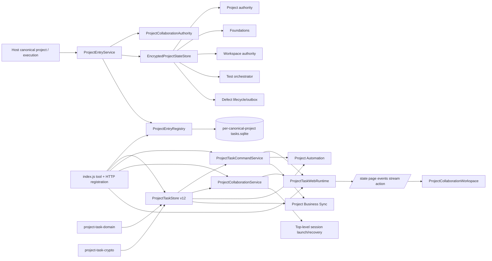

# 官方核心替换：自研依赖图与边界审计

> 审计对象：维护工作树 `release-v1.0.28-worktree`（桌面包版本 1.0.54）。
>
> 审计性质：**本地静态引用图 + 隔离行为契约**，不判断某个官方版本已经等价，也不授权删除产品代码。官方版本/API 等价性以并行产物 `OFFICIAL-CORE-COMPATIBILITY-AUDIT.zh-CN.md` 的源码证据为准。
>
> 可执行门禁：`node --test tests/official-core-compatibility-contract.test.cjs`。

## 1. 结论

当前“项目级跨会话任务”不是可按文件名一对一替换的单模块，而是五层调用链：

1. **项目身份与 lane**：`ProjectEntryService` 验证本机 authority/grant；`ProjectEntryRegistry` 把 Host canonical project key 映射到独立 opaque lane、projectRef、密钥和 SQLite 文件，并处理一次性旧库绑定。
2. **领域与持久化**：七态任务、RBAC、CAS、attempt/review、事件/receipt、协作席位/锁/两阶段移交/证据/请求/失败根恢复共同落在 `ProjectTaskStore` schema v12。
3. **服务与 Host 工具**：`ProjectTaskCommandService`、`ProjectCollaborationService` 从不可伪造 execution 解析 actor；`index.js` 注册 `project_task`、`project_collaboration` 和根会话恢复/启动链。
4. **Web 安全投影**：`ProjectTaskWebRuntime` 提供有界 DTO、AEAD keyset cursor、128 KiB 页面、SSE；Host 只在受信 origin 和显式 header 下接受窄写操作。
5. **UI 与下游**：唯一“跨会话任务”工作区对项目任务/协作的常规变更只做安全投影、刷新、分页和 composer 草稿，不直接 POST/create/update；但它同时承载 confirm-first 的失败根恢复与成员恢复入口，分别经 `runRootRecovery → props.onRootRecovery → recoverProjectRoot` 和 `MemberRecovery* → onRecover/onReconcile` 进入 Host 写平面。Project Automation、Business Sync、根会话启动/恢复、项目 Foundations、缺陷/质量/工作区 authority 等也仍消费这些底层能力。

因此：**禁止因官方核心出现同名 Task/Team/Project API 就删除自研文件。** 任一删除候选必须先证明其所有调用边、状态语义、安全边界和迁移数据都已由官方端口覆盖；否则迁往官方端口或保留 adapter。

## 2. 静态生产引用图



### 2.1 精确直接 import 边

`tests/official-core-compatibility-contract.test.cjs` 以词法扫描生产 `lib/*.js`，覆盖 static import（含 side-effect import）、`export ... from`、dynamic `import()` 和受控 CommonJS `require()`；注释、普通字符串和模板字面量中的近似文本不会计为依赖。任何新增或消失的这些可静态解析直接消费者都会使门禁失败，要求重新审计；计算型 module specifier 本身不允许绕过审计。

| 被消费模块 | 当前直接生产消费者 | 替换含义 |
|---|---|---|
| `project-task-domain.js` | `project-automation-web.js`、`project-business-sync-runtime.js`、`project-business-sync-store.js`、`project-task-service.js`、`project-task-store.js`、`project-task-web.js` | 状态枚举/转换/RBAC/attempt/review 不是 UI 私有逻辑；Automation、Sync 也需同一语义 |
| `project-task-store.js` | `index.js`、`project-automation-web.js`、`project-business-sync-runtime.js`、`project-task-service.js`、`project-task-web.js` | 不能先删 Store 再补消费者；五处都必须改走 port |
| `project-task-service.js` | `index.js`、`project-automation-web.js`、`project-business-sync-runtime.js`、`project-task-web.js` | 工具、Automation、Sync、Web 必须共享同一 actor/CAS/idempotency 语义 |
| `project-task-web.js` | `index.js` | 这是合适的 Web adapter seam；UI 不应直接依赖官方存储对象 |
| `project-task-crypto.js` | `project-task-store.js` | 若官方存储接管加密，仍须迁移 AAD/密钥作用域；不能把旧密文当明文导入 |
| `project-collaboration.js` | `project-authority-service.js`、`project-entry-service.js` | membership grant、epoch、撤销与项目身份在任务层之前 |
| `project-state-store.js` | `defect-lifecycle-service.js`、`external-defect-outbox.js`、`project-authority-service.js`、`project-automation-store.js`、`project-business-sync-store.js`、`project-entry-service.js`、`project-foundations-runtime.js`、`test-orchestrator-service.js`、`workspace-authority-service.js` | 这是共享加密状态设施，绝不能因“官方 Project Task”到来整体删除 |

### 2.2 Host、工具、HTTP、UI 入口

| 入口 | 当前路径 | 必须保留的契约 |
|---|---|---|
| 模型任务工具 | `index.js` → `project_task` → `withProjectCollaborationContext` → `ProjectTaskCommandService` | Host 派生 project/actor；request 不得提交 projectRef、sessionId、actorRef、role/authority |
| 模型协作工具 | `index.js` → `project_collaboration` → `ProjectCollaborationService` | root/lead/member 权限分离；claim_next、请求、锁、移交、证据、恢复各自 fail closed |
| 根会话启动/恢复 | `project_session_launch`、失败 observer、recovery ledger → Collaboration Service/Store | exact operation/session evidence、一次性 adoption capability、outcome_unknown 显式定案、不得隐藏 subagent 代替 root |
| HTTP 状态 | `GET /api/agent-teams/project/tasks/state` | authority 完整视图；collaborator 只读 safe cache 且 `totalExact:false` |
| 分页 | `GET .../page?cursor=` | 任务/八协作区 keyset cursor 绑定 project/revision/section/完整 boundary；旧/篡改/跨项目失效 |
| 增量 | `GET .../events` 与 `GET .../stream` | 有界 event window、gap/reset、SSE keepalive/cleanup；Business Sync 变化触发 reset |
| 窄写 | `POST .../action` | trusted origin + `x-harness-agent-teams: 1` + 64 KiB + allowlist；Host 生成 task/event ref |
| 唯一 UI：常规任务/协作 | `client.js` → `ProjectCollaborationWorkspace` → task state/page/SSE | 只观察/刷新/分页/生成 composer 草稿；工作区本体没有常规任务/协作 POST、create/update 调用 |
| 唯一 UI：失败根恢复 | `runRootRecovery`（二次点击确认）→ `props.onRootRecovery` → 父级 `recoverProjectRoot` → `postAction(..., "root-recovery-continue", { confirm:true })` | 只允许安全投影给出的 recoveryRef/revision/action；busy/confirm/error 状态不可绕过；Host 仍验证 exact root、OCC、evidence 与 unknown outcome |
| 唯一 UI：成员恢复 | `MemberRecoveryPanel` / `MemberRecoveryReconcilePanel` → `onRecover` / `onReconcile` → `recoverProjectMember` / `reconcileProjectMember` | 只消费可信 teamId/expectedRevision/requestId 投影；确认与 Host lifecycle 权限、receipt/OCC 必须保留 |

## 3. Schema、迁移与不可丢失状态

### 3.1 schema v12 事实族

| 事实族 | 表/索引 | 不可丢失语义 |
|---|---|---|
| 项目与任务 | `project_task_projects`、`project_tasks`、status/priority 复合窗口索引 | 每 projectRef 独立 revision；七态；priority；requirementsRevision；单 root 单活任务 |
| 事件与幂等 | `project_task_events`、`project_task_command_receipts`、`project_task_claim_next_receipts` | project revision 连续；command/event 唯一；相同 intent 重放，漂移冲突；claim_next 原子 receipt |
| 执行与评审 | actors/comments/relations/attempts/reviews | 依赖无环；需求变化使 attempt/review 失效；执行者不得自批准；done 需要当前已批准 review |
| 协作板 | boards/seats/locks/handoffs/evidence/history | root/member 席位边界；层级资源锁；两阶段移交；项目相对证据；可审计历史 |
| 协作请求 | `project_collaboration_requests` + active identity unique index | no-wake 持久请求、去重、期限、target ownership、显式响应/审计解决 |
| 根席位/恢复 | root_reservations/root_recoveries | 一次性 capability；失败者/发起者/受益者分栏；retry/takeover；outcome_unknown 不自动重试 |

所有敏感任务标题、requirements、fileScope、事件 payload、receipt、协作说明/证据/历史均使用 AES-256-GCM 字段信封，AAD 至少绑定 `version + algorithm + projectRef + field`。错误 project、错误 field、错误 key 或密文篡改必须报 `PROJECT_TASK_CIPHERTEXT_INVALID`。

### 3.2 现有迁移边界

- SQLite `user_version` 从 0 顺序迁到 12，每级用 `BEGIN IMMEDIATE`；遇到大于 12 的 schema 拒绝打开，不能降级猜读。
- 旧全局 `$DSH_HOME/storages/agent_project_tasks.sqlite` **永不就地删除**。`ProjectEntryRegistry` 只在唯一 canonical 证据或 exact direct-human `bind_legacy` 下，以 SQLite backup（包含 WAL 一致视图）复制到 opaque lane。
- marker 采用 `copying → complete`；崩溃恢复只清理未完成目标/临时副本。已绑定 A 后，B 得到独立空 lane；B 不能抢绑旧库。
- 新 lane 使用从 authority key + canonical lane 派生的独立 projectRef/key/file；Hot path 不进入一次性 migration chain。

官方替换必须提供可验证的 schema 映射，而不是“官方也有 tasks”这一同名证明。至少映射：状态、priority、task/project revision、requirements revision、关系、attempt/review、command/claim receipt、席位、锁、移交、证据、请求、恢复状态和所有安全时间戳。

## 4. 缓存、锁与队列

| 设施 | 所在层 | 语义/风险 | 替换要求 |
|---|---|---|---|
| SQLite WAL + `synchronous=FULL` + FK + 5s busy timeout | Task Store | 崩溃持久性、跨 Store CAS | 官方端口需给等价 transaction/receipt 保证；否则保留 Store adapter |
| `BEGIN IMMEDIATE` | migration、所有 mutation、claim_next | 原子单活、锁/任务/receipt 同事务 | 禁止拆成多个最终一致调用后声称等价 |
| 每 canonical lane | Entry Registry | 项目隔离、无跨项目全局扫描/锁 | 官方 identity 必须稳定映射 canonical project；不得退回单全局库 |
| `migrationChain` + `laneModes` | Entry Registry | 一次性旧库决策，已知 lane 快路 | 迁移 adapter 保留到所有旧 lane 验证完成 |
| Web `tail` | Task Web Runtime | state/page/action/close 顺序化，close 后拒绝新工作 | 官方 Web adapter 需规定 draining/close 语义 |
| Collaboration page cache + debounce timers | Web Runtime | 按 project revision 缓存八区安全窗口；SSE 合并 | 切换/重绑/close 必须清空；不能跨项目复用 |
| AEAD cursor process key | Web Runtime | cursor 对 project/revision/section/boundary 认证；重启自然失效 | 官方 cursor 若格式不同只能由 adapter 翻译首屏，不得解封后信任客户端字段 |
| Business Sync queue/outbox/cache | Business Sync Runtime/Store | collaborator 有界 safe cache、receipt、reset/backpressure | 官方只接管 authority task API 时仍须保留 Sync adapter，或迁移为官方远端协议 |
| Automation queue/runner | Automation Store/Runtime | 人工批准、effect idempotency、项目任务 transition | 官方 task transition 接管前需重绑 runner receipt；不能双执行 |
| Hierarchical collaboration locks | Task Store | `a` 与 `a/b` 冲突；仅 owner/协调者释放 | 官方无层级资源锁时必须保留 overlay adapter |

## 5. 测试、fixture、文档与下游消费者

### 5.1 直接专项

- Domain/Store/Service/Web/API：`project-task-domain.test.cjs`、`project-task-store.test.cjs`、`project-task-service.test.cjs`、`project-task-web.test.cjs`、`project-task-api.test.cjs`。
- Authority/Entry/multi-project：`project-collaboration.test.cjs`、`project-authority-service.test.cjs`、`project-entry-service.test.cjs`、`project-multi-project-isolation.test.cjs`、`agent-teams-cross-session-multi-project-qa.test.cjs`。
- 工具/UI/性能/连续工作：`agent-teams-tools.test.cjs`、`agent-teams-workbench-ui.test.cjs`、`agent-teams-cross-session-board-performance.test.cjs`、`agent-teams-cross-session-continuous-work.test.cjs`。
- Automation/Sync：`project-automation-*.test.cjs`、`project-business-sync-*.test.cjs`。
- 本审计新增：`official-core-compatibility-contract.test.cjs`（引用图、port 形状、schema/密文/隔离/幂等、身份/自验收/cursor 负向断言）。
- `tests/fixtures/project-secret-capability.cjs` 被 Project Task API、Business Sync API 和 Foundations 工具测试共同使用；不能只更新某一套 fixture。

### 5.2 文档消费者

`AGENT-TEAMS-ARCHITECTURE.zh-CN.md`、`AGENT-TEAMS-USER-GUIDE.zh-CN.md`、`AGENT-TEAMS-TASKBOARD-DESIGN-DRAFT.zh-CN.md` 已把“唯一跨会话任务入口”“底层 Project Tasks/Automation 继续存在”“claim_next/游标/迁移/恢复”写成产品契约。切换官方实现时必须同步事实描述，不能提前删除旧能力声明或宣称 remote collaborator 完整分页。

### 5.3 仍有消费者时的具体去向

| 能力 | 官方完全等价时 | 官方部分等价或无证据时 |
|---|---|---|
| Task CRUD/状态/CAS/receipt | `OfficialTaskPort` 适配官方 API；Host 工具和 Web 不直接 import 官方包 | 保留 `ProjectTaskStore/CommandService`，只把已证明等价的读/写逐项路由官方 |
| attempt/review/requirements revision | 映射官方执行/评审 ID 与 revision，验证 stale/self-approval/done gate | 作为本地 safety overlay；官方任务 ID 只作为外键 |
| canonical project lane | `OfficialProjectIdentityPort` 证明稳定、隔离、撤销后再替换 Registry | 保留 Registry；官方 project id 作为 lane metadata，不作密钥或 actor 输入 |
| collaboration seats/locks/handoffs/evidence/requests | `OfficialCollaborationPort` 覆盖全部 transaction 与 RBAC | 保留 overlay Store/Service；不要把官方 Team/Task 同名当作覆盖 |
| root launch/recovery | 官方提供 exact session operation ledger、adoption capability、unknown resolution 才接管 | 保留 session-launch + root recovery adapter；UI 的 confirm-first 只是一道交互门，官方 session API 只能作为受控 transport，Host evidence/OCC 不能下放浏览器 |
| member recovery/reconcile | 官方能绑定 exact team revision、opaque member、requestId/receipt 与 direct-root authority 后迁入 `OfficialRecoveryHostPort` | 保留 `postMemberRecovery`、`recoverProjectMember`、`reconcileProjectMember` 及 Host lifecycle adapter；不得因官方有 member restart 就删除 |
| Web/SSE/UI | `OfficialProjectionPort` 输出当前 safe DTO 与预算/游标语义，恢复动作另走 `OfficialRecoveryHostPort` | 保留 Web Runtime adapter，对官方输出重投影；UI API 路径、confirm/busy/error 状态与父级 recovery wiring 保持稳定 |
| Automation | 将 runner effect key/receipt 原子绑定官方 transition | 保留现有 runner/Store；禁止同一 action 双写双方 |
| Business Sync | 官方 remote 协议覆盖 safe cache/receipt/reset/backpressure 后迁移 | 保留 Sync；authority 从官方 port 取事件，但 collaborator 不直连官方内部对象 |
| `project-state-store` 其他用户 | 各独立 authority/defect/quality/foundations 均迁完才可移除 | 长期保留通用加密状态 adapter，绝不能随 Task 模块删除 |

## 6. Official adapter seam

建议只在 Host 内建立以下端口；UI、工具 schema 和下游服务不直接 import 官方内部包：

```text
OfficialProjectIdentityPort
  open(canonicalProjectKey) -> { projectRef, execution, resolveActor, capabilities, dispose }

OfficialTaskPort
  state/page/events/subscribe
  execute(command, execution) / receipt(commandId, execution)
  claimNext(requestId, execution)

OfficialCollaborationPort
  sectionPage(section, cursor, execution)
  seat/request/respond/lock/handoff/evidence/recovery(...)

OfficialRecoveryHostPort
  continueRoot(recoveryRef, expectedRevision, action, confirmedExecution)
  recoverMember(teamRef, expectedRevision, opaqueMember, action, requestId, confirmedExecution)
  reconcileMember(teamRef, expectedRevision, requestId, resolution, confirmedExecution)

OfficialProjectionPort
  safeState/safePage/safeError
  sealCursor/openCursor
```

端口约束：

1. `execution` 必须是 Host capability，不可序列化；actor/project/role/authority 一律从 capability 派生。
2. 写方法必须接受稳定 request/command id、预期 revision，并返回可持久验证的 receipt；“请求已发出”不等于 effect 成功。
3. Port 的 DTO 先经本地 safe projection，再进入 Web/UI；raw sessionId、路径、账号、设备、错误正文、密钥和官方内部对象不得透传。
4. 官方异常统一映射为当前固定错误码/HTTP nextAction；未知错误不能默认为 retryable mutation。
5. 迁移期间 adapter 必须记录来源（custom/official/shadow）、schema 版本、lane、revision 与比较结果，但日志不得含敏感正文。
6. 浏览器的二次点击/confirm 状态只证明用户完成 UI 手势，不是授权事实；`OfficialRecoveryHostPort` 仍须由 Host 校验 direct root、project/team/revision、failure evidence、receipt 与 `outcome_unknown` 定案权限。

## 7. 双读、迁移、切换与回滚顺序

### Phase 0：冻结基线

- 固定官方 tag/commit、许可证、API/源码证据；运行本文件列出的全部门禁。
- 为每个候选能力建立“字段、命令、状态、错误、权限、transaction、性能”逐项矩阵。任一未知项视为不等价。
- 记录每 canonical lane 的 opaque migration id、custom schema/revision/counts/digests；不记录 raw cwd 或敏感字段。

### Phase 1：只读 adapter + shadow read

- 产品仍以 custom 为唯一 authority。
- Official port 只读同一测试/影子数据；adapter 比较安全投影的精确 totals、分组、排序边界、revision、权限和错误分类。
- 禁止 UI 或工具根据 official shadow 结果行动；差异只进入脱敏诊断。失败根/成员恢复在此阶段继续只走 custom Host recovery adapter，不能由 official shadow 投影触发。

### Phase 2：lane 级可恢复 backfill

- 每 lane 获取一致 custom snapshot（含 WAL），写入 official staging namespace。
- 写入 migration receipt：源 schema/revision/digest、目标 revision/digest、映射版本、状态 `prepared/verified/committed`。
- 对 tasks/relations/attempts/reviews/receipts/collaboration 各自做 exact count + 语义校验；密文只在本机受控 adapter 内解封和重封。
- 任一失败只回滚该 lane staging，不影响其他项目；旧库保持只读可恢复副本。

### Phase 3：受控写切换（禁止裸双写）

- 不做两个 authority 的“尽力双写”。每个命令先由 adapter 持久化统一 intent/outcome，再交唯一 primary 执行；secondary 只能从 committed event/receipt 异步重放。
- 小批 lane 切为 official primary；custom 保存 append-only rollback journal/last verified revision，不接受独立第二次 effect。
- `outcome_unknown` 停止自动重试，必须 observer-first 查询 official receipt；无 receipt 时由现有显式定案路径处理。根/成员恢复不得随普通 Task 写切换自动迁移，必须分别证明 `recoverProjectRoot` 与 member recover/reconcile 的 confirm、exact revision、receipt 和 Host authority 等价。

### Phase 4：读切换与观察期

- UI/工具仍走稳定端口和原 API 路径，读 primary 改为 official。
- 继续对 custom rollback projection 做 shadow compare；满足观察窗口后才停止 secondary replay。
- Automation、Business Sync、root recovery、member recovery/reconcile 分别切换；每条恢复 wiring 都须做 confirm-first → parent callback → Host action 的端到端演练，不能因 Task 主链通过而批量宣布完成。

### Phase 5：隔离旧实现而非立即删除

- custom DB 改只读、写入 cutover receipt 并保留版本化恢复工具；不得删除 legacy marker/lane 映射。
- 至少跨一次应用升级、一次进程重启、一次回滚演练后，才评估删除 adapter 的独立任务。
- 删除前重新运行静态 importer 门禁；预期消费者列表必须先通过代码迁移而自然归零/改指 official port，禁止改测试列表掩盖活跃消费者。

### 回滚

| 时点 | 回滚动作 |
|---|---|
| Phase 1/2 | 丢弃 official staging；custom 未失去 authority，无数据回写 |
| Phase 3 单 lane | 停止新命令，查清所有 prepared/unknown intent；把已 committed official event 按 receipt 重放 custom，校验 revision/digest 后恢复 custom primary |
| Phase 4 | Web/工具端口切回 custom projection；cursor 全部 reset（不得翻译旧 cursor）；SSE 发 reset；Automation/Sync 只在 receipt 对齐后恢复 |
| 旧库只读后 | 使用 cutover receipt + rollback journal 恢复到新文件，不覆盖原只读快照；canonical lane/projectRef/key 映射保持不变 |

## 8. 验收门禁

以下全部满足前，不得删除或默认启用官方替换：

1. **引用图门禁**：生产 importer 精确清单经重新审计；所有 Host/工具/API/UI/Automation/Sync/StateStore 消费者均已迁往 official port 或显式保留 adapter。
2. **行为门禁**：七态转换、CAS、idempotency drift、dependency、attempt/review、self-approval、claim_next 单活、锁层级冲突、两阶段移交、请求期限/解决、root recovery unknown、member recovery/reconcile 全部正负向通过；UI 需证明普通任务无直接写入口，同时恢复动作保持 confirm-first、父级 callback 与 Host action wiring。
3. **安全门禁**：Host-derived identity、跨项目隔离、密文 AAD、safe DTO、trusted origin、body/depth、无 raw session/path/actor 注入。
4. **数据门禁**：每 lane exact totals/digest；schema/字段映射完整；旧库、marker、receipt、event、recovery ledger 均可回滚；未来 schema fail closed。
5. **分页/性能门禁**：任务和八区完整遍历 exact+unique；AEAD cursor 防篡改/跨项目/陈旧；128 KiB、24/120 只是页预算；无全局项目扫描或全局迁移锁。
6. **生命周期门禁**：重启、close/drain、SSE reset、collaborator offline/reconnect、Automation runner、Business Sync outbox、root launch/recovery 演练通过。
7. **发布门禁**：本审计不执行发布。实际切换必须另行完成完整测试、打包自检与仓库正式发布门禁。

## 9. 本审计的负向证据

新增契约不是当前实现字符串快照的替代品，而是三类证据组合：

- **结构证据**：词法扫描真实生产 static import、re-export、dynamic import 与受控 require 边，并用纯函数 fixture 证明注释/字符串/模板近似文本不误报；Host route/tool/UI seam 同时锁定“常规任务无直接写入口”和“confirm-first 根/成员恢复经父级进入 Host 写平面”两类边界。
- **运行时证据**：真实初始化 SQLite schema v12，创建两个 project 的任务，验证 project 隔离、WAL、密文字段、receipt 重放与漂移冲突；构造 future schema 13 验证拒绝降级。
- **安全行为证据**：执行真实 domain/actor/crypto/Web cursor 代码，负向证明身份注入、自批准、错误 project/field 密文、跨项目/篡改 cursor 均 fail closed。

这些门禁只证明**当前替换边界被捕获**。它们不会自行证明某个官方版本已兼容；官方等价仍需源码差异审计和迁移演练共同给出证据。
